# 无人值守安装iso并在Virtualbox中完成自动化安装

## 实现特性

- 定制一个普通用户名和默认密码
- 定制安装OpenSSH Server
- 安装过程禁止自动联网更新软件包

## 实验环境

- VirtualBox
- 操作系统：ubuntu-16.04.4-server-amd64
- 连网方式：NAT网络、仅主机（HOST-ONLY）网络

## 实验步骤

1. 虚拟机未安装增强功能，使用PUTTY连接
2. 使用PSFTP传输ubuntu-16.04.4-server-amd64.iso
> open ip_addr
>
> put path\ubuntu-16.04.4-server-amd64.iso

3. 命令如下

```
# 在当前用户目录下创建一个用于挂载iso镜像文件的目录
mkdir loopdir

# 挂载iso镜像文件到该目录
mount -o loop ubuntu-16.04.1-server-amd64.iso loopdir

# 创建一个工作目录用于克隆光盘内容
mkdir cd

# 同步光盘内容到目标工作目录
# 一定要注意loopdir后的这个/，cd后面不能有/
rsync -av loopdir/ cd

# 卸载iso镜像
umount loopdir

# 进入目标工作目录
cd cd/

# 编辑Ubuntu安装引导界面增加一个新菜单项入口
vim isolinux/txt.cfg
```

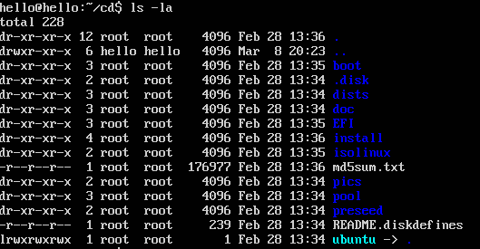

4. 在 isolinux/txt.cfg 中添加如下内容。需要使用 sudo 权限打开isolinux/txt.cfg ，*：wq!* 关闭vim

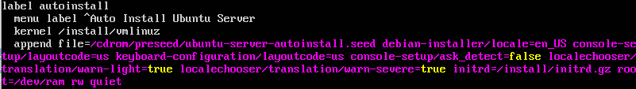

5. 阅读并编辑定制Ubuntu官方提供的示例preseed.cfg，并将该文件保存到刚才创建的工作目录~/cd/preseed/ubuntu-server-autoinstall.seed

6. 修改isolinux/isolinux.cfg，增加内容timeout 10（可选，否则需要手动按下ENTER启动安装界面）

7. 重新生成 md5sum.txt

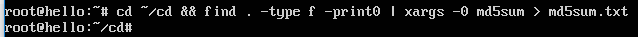

8. 封闭改动后的目录到.iso 。将如下代码写到 .sh 文件，然后执行。首先需要  *sudo apt install mkisofs*

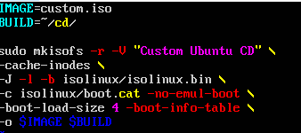

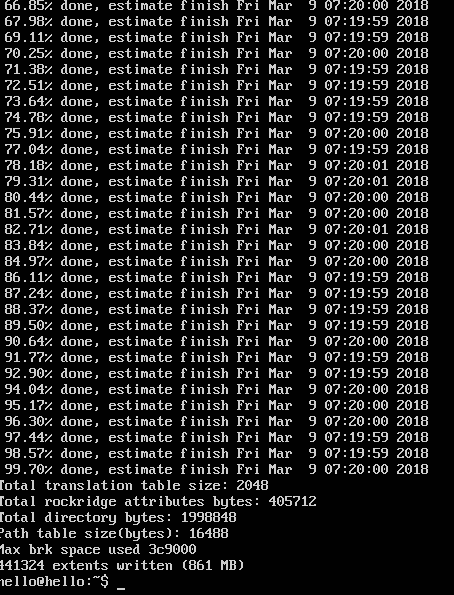

9. 使用PSFTP将 cusiom.iso get 出来


10. 使用 custom.iso 安装Unbuntu

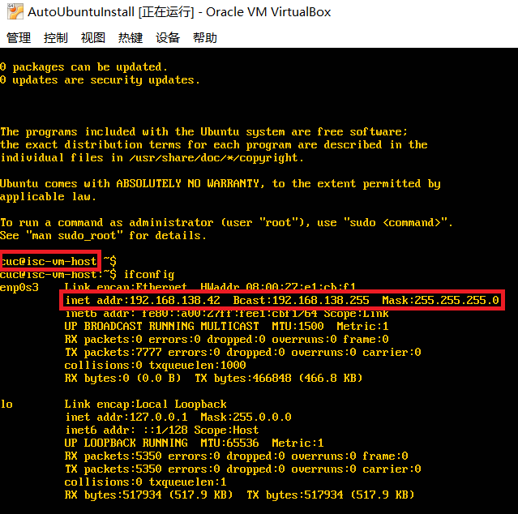

## 官方提供的示例 preseed.cfg 与定制的 ubuntu-server-autoinstall.seed 对比

### locales设置
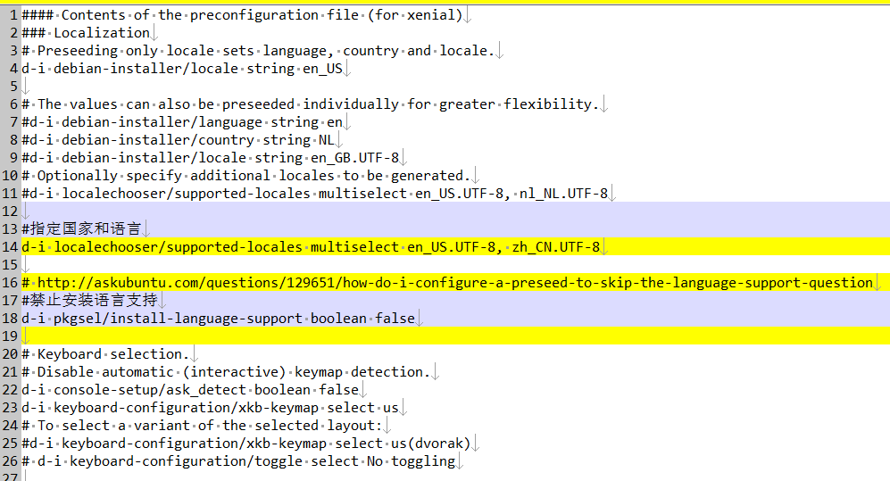

### 网络设置
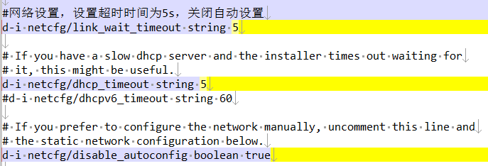

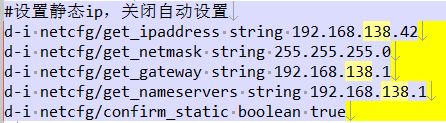

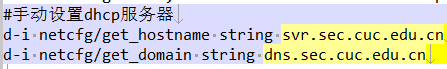

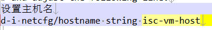

### 账户设置
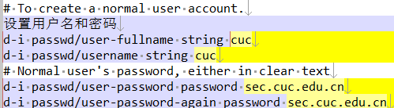

### 时区设置
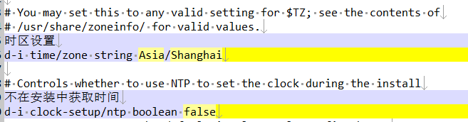

### 磁盘分区
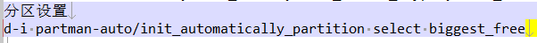

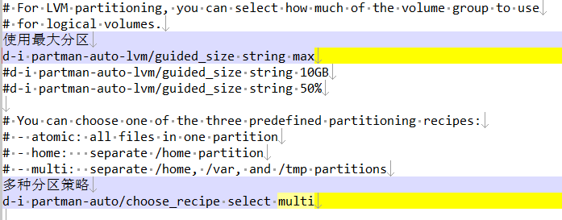

### apt设置
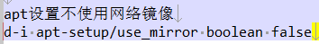

### 安装包及自动更新默认设置
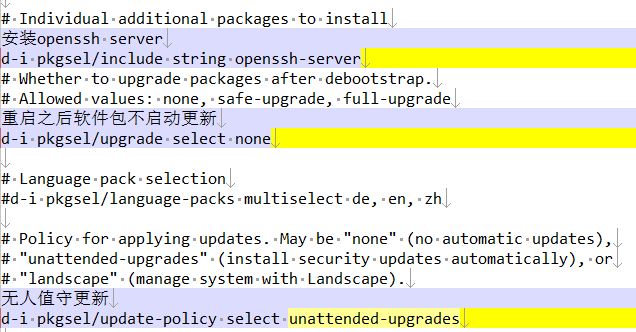


## 遇到的问题
1. 重新生成 md5sum.txt 时，执行 *cd ~/cd && sudo find . -type f -print0 | xargs -0 md5sum > md5sum.txt* 也会权限不足Prmission denied, 执行 *cd ~/cd && sudo find . -type f -print0 | xargs -0 md5sum > ../md5sum.txt* 还是会Prmission denied，于是使用 *sudo -s* 切换为root用户
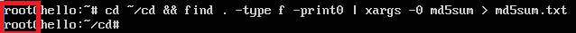

2. 封闭改动后的目录到.iso，执行相应命令，出现如下错误，于是将 *mkisofs -r -V "Custom Ubuntu Install CD"* 缩减为 *mkisofs -r -V "Custom Ubuntu CD"* </br>


## 参考链接

[http://sec.cuc.edu.cn/huangwei/course/LinuxSysAdmin/chap0x01.exp.md.html#/](http://sec.cuc.edu.cn/huangwei/course/LinuxSysAdmin/chap0x01.exp.md.html#/)

[https://github.com/CUCCS/linux/tree/master/2017-1](https://github.com/CUCCS/linux/tree/master/2017-1)
