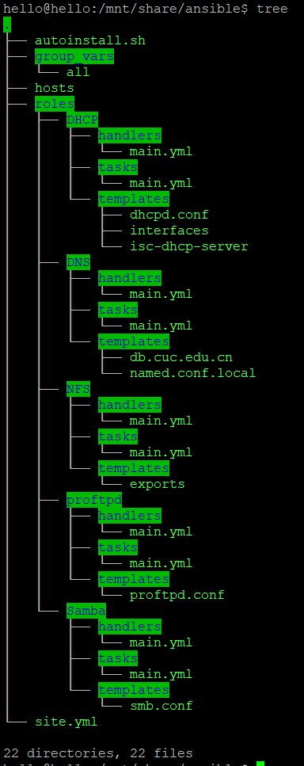
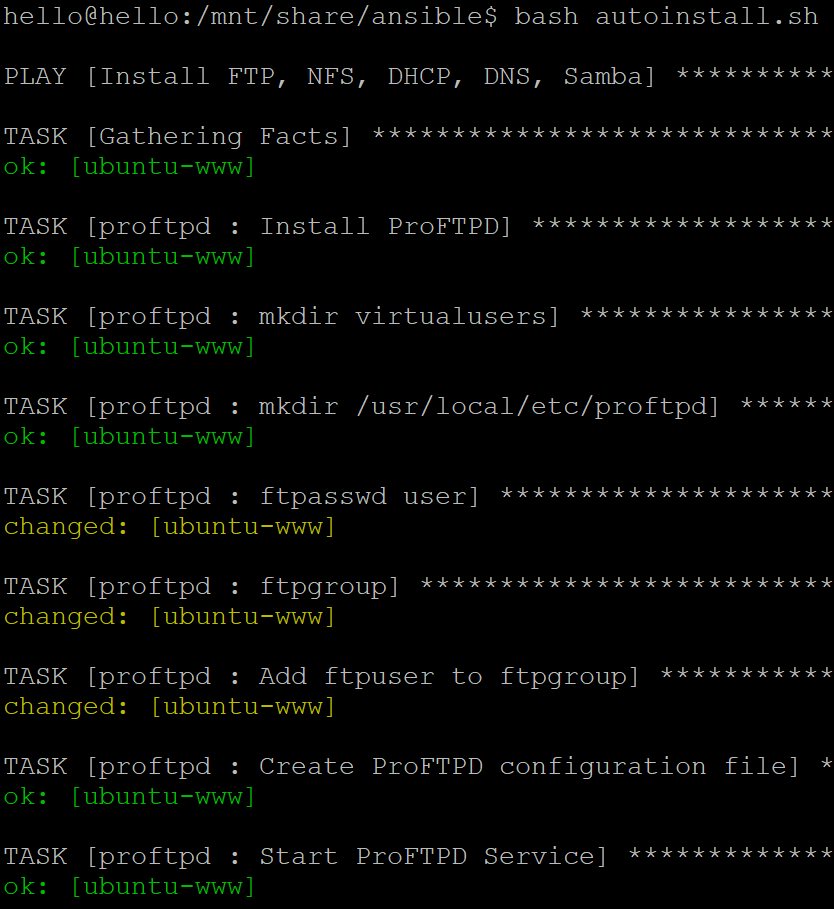
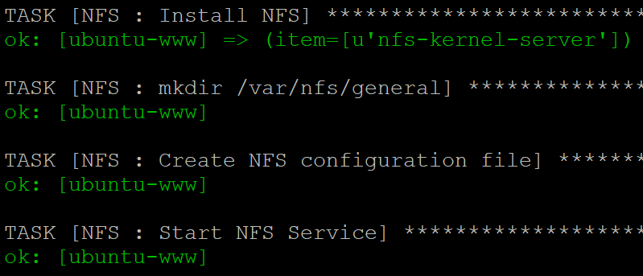
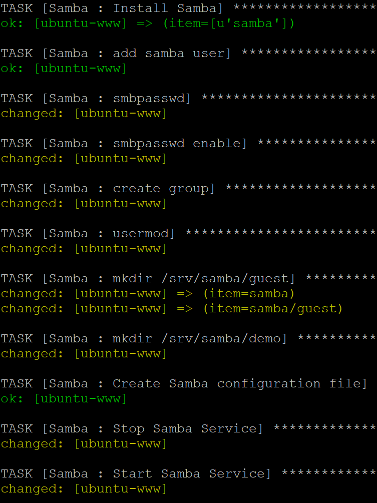
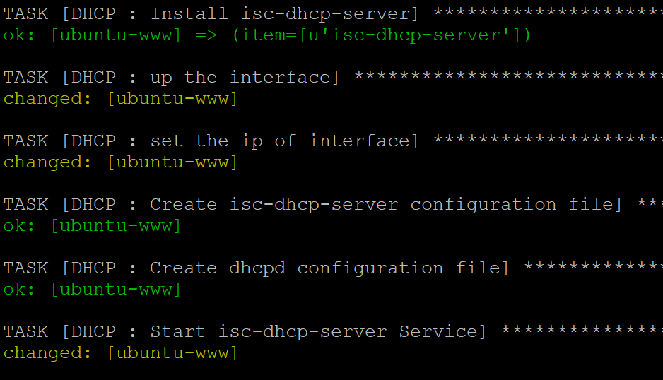
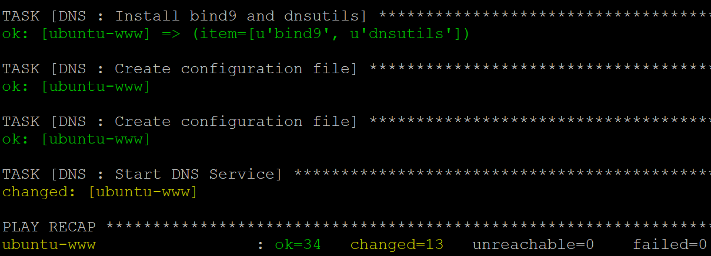

# ansible一键部署FTP、NFS、DHCP、DNS、Samba服务器

## [安装](http://docs.ansible.com/ansible/latest/installation_guide/intro_installation.html#control-machine-requirements)

## [一键部署](ansible/)
```bash
ansible-vault create vault.yml

ansible-vault edit vault.yml

ansible-playbook -i hosts site.yml --ask-vault-pass

```
Vault password: **password**













## 参考链接
[ansible课件](http://sec.cuc.edu.cn/huangwei/course/LinuxSysAdmin/ansible.md.html#/)

[ansible官方示例代码：wordpress-nginx](https://github.com/ansible/ansible-examples/tree/master/wordpress-nginx)

[ansible file module](http://docs.ansible.com/ansible/latest/modules/file_module.html)

[ansible user module](http://docs.ansible.com/ansible/latest/modules/user_module.html)

[ansible service module](http://docs.ansible.com/ansible/latest/modules/service_module.html)

[ansible vault](https://docs.ansible.com/ansible/2.4/vault.html)
