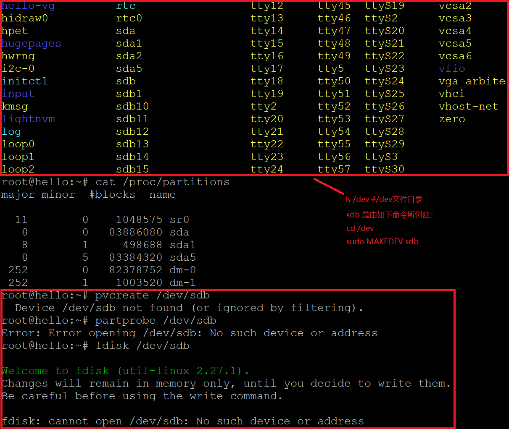

# systemd
## 命令篇
- 系统管理
  - systemctl
  - systemd-analyze
  - hostnamectl
  - localectl
  - timedatectl
  - loginctl
  - 录制视频：[https://asciinema.org/a/HxRRLZiU64j2i5o28dGCIoos5](https://asciinema.org/a/HxRRLZiU64j2i5o28dGCIoos5)

- Unit
  - [https://asciinema.org/a/8pYBoh3mHik6a1xvMuazzuwb1](https://asciinema.org/a/8pYBoh3mHik6a1xvMuazzuwb1)

- Unit 的配置文件
  - [https://asciinema.org/a/FsPr5b1LXhHhr0ZR4U7YQDkVm](https://asciinema.org/a/FsPr5b1LXhHhr0ZR4U7YQDkVm)

- Target
  - [https://asciinema.org/a/Xqw4SVOhKNnNnVZge9w28PCiv](https://asciinema.org/a/Xqw4SVOhKNnNnVZge9w28PCiv)

- 日志管理
  - [https://asciinema.org/a/YGflZU2nDgV1ym6rr6AZ2ABUP](https://asciinema.org/a/YGflZU2nDgV1ym6rr6AZ2ABUP)

## 实战篇
- [https://asciinema.org/a/DdjgDm1ge8gWVFlR5GJd75M8z](https://asciinema.org/a/DdjgDm1ge8gWVFlR5GJd75M8z)

## 自查清单
1. 如何添加一个用户并使其具备sudo执行程序的权限？
  - 添加cuc用户`adduser cuc`
  - 在`/etc/sudoers`中添加`cuc ALL=(ALL:ALL) ALL`


2. 如何将一个用户添加到一个用户组？
```bash
# 创建组，把cuc用户添加到testgroup
sudo addgroup testgroup
sudo usermod cuc -a -G testgroup
```


3. 如何查看当前系统的分区表和文件系统详细信息？
  - `fdisk -l`只能列出硬盘的分区表、容量大小以及分区类型，但看不到文件系统类型。

  - 用`parted` 查看 /dev/sda 各分区的文件系统类型

4. 如何实现开机自动挂载Virtualbox的共享目录分区？


- 在`sudo gedit /etc/fstab`文件末添加一项：
`<共享名称> <共享目录> vboxsf defaults 0 0`


5. 基于LVM（逻辑分卷管理）的分区如何实现动态扩容和缩减容量？


6. 如何通过systemd设置实现在网络连通时运行一个指定脚本，在网络断开时运行另一个脚本？
- 在networking.service配置文件的区块[Service]
```bash
[Service]
...
ExecStart=<脚本路径>
ExecStop=<脚本路径>
...
```
7. 如何通过systemd设置实现一个脚本在任何情况下被杀死之后会立即重新启动？实现杀不死？
  - 配置文件的区块[Service]
  ```bash
  [Service]
  ...
  Restart=always
  ...
  ```

## 遇到的问题
1. Nginx: Failed to start A high performance web server and a reverse proxy server


原因：已经开启apache2并在监听80端口

解决方法：

```bash
# 关闭apache2
service apache2 stop

# 重启nginx
service nginx restart

# 查看nginx状态
systemctl status nginx.service
```


2. 本来要重新[创建分区，再对分区进行扩容和缩减](https://blog.csdn.net/xinxing__8185/article/details/51443930)，但是一直报错，没有找到有用的解决方法。

  - 参考[[LVM] pvcreate - ignored by filtering](https://www.linuxquestions.org/questions/linux-newbie-8/%5Blvm%5D-pvcreate-ignored-by-filtering-4175559389/)和[/dev/sdb: No such file or directory (but /dev/sdb1 etc. exists)](https://unix.stackexchange.com/questions/56516/dev-sdb-no-such-file-or-directory-but-dev-sdb1-etc-exists)都没解决报错



## 参考资料
[linux下添加用户并赋予root权限](https://blog.csdn.net/stormbjm/article/details/9086163)

[Linux添加/删除用户和用户组](https://www.cnblogs.com/xd502djj/archive/2011/11/23/2260094.html)

[自动挂载Virtualbox的共享目录分区](https://askubuntu.com/questions/252853/how-to-mount-a-virtualbox-shared-folder-at-startup)
