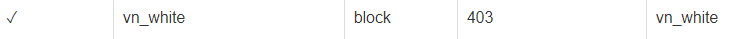
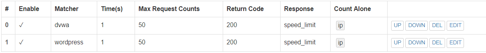

# 实验五：搭建高级的Web服务器

## 软件环境建议
### 虚拟机配置
| 主机 | 网卡1 | 网卡2 | 搭建的服务器
| - | :-: | :-: | -: |
| Ubuntu Server 16.04 | Nat网络 | Host-only网络：192.168.232.4 (dhcp 有时候是192.168.232.5) | verynginx
| Ubuntu Server 16.04 | Nat网络 | Host-only网络：192.168.232.3 | WordPress、DVWA
| win10 用于测试|


### Nginx
### VeryNginx
[VeryNginx安装](https://github.com/alexazhou/VeryNginx/blob/master/readme_zh.md)
```bash
sudo git clone https://github.com/alexazhou/VeryNginx.git

sudo update-alternatives --install /usr/local/bin/python python /usr/bin/python3 10

sudo apt install libpcre3 libpcre3-dev libssl-dev build-essential

# 查找指定进程占用哪个端口
ps aux | grep nginx
sudo netstat -aonp | grep nginx

# 安装ab
sudo apt install apache2-utils

ab -n 1000 -c 10 http://192.168.232.3/index.html

```


### WordPress 4.7
- 安装WordPress 4.7
  - [Install Linux, Nginx, MySQL, PHP (LEMP stack) in Ubuntu 16.04](https://www.digitalocean.com/community/tutorials/how-to-install-linux-nginx-mysql-php-lemp-stack-in-ubuntu-16-04)
  - [创建自签发SSL证书](https://www.digitalocean.com/community/tutorials/how-to-create-a-self-signed-ssl-certificate-for-nginx-in-ubuntu-16-04)
  - [Install WordPress with LEMP on Ubuntu 16.04](https://www.digitalocean.com/community/tutorials/how-to-install-wordpress-with-lemp-on-ubuntu-16-04)

### Damn Vulnerable Web Application (DVWA)
- [安装DVWA](https://github.com/ethicalhack3r/DVWA)

## 实验检查点

---

### 基本要求

* 在一台主机（虚拟机）上同时配置[Nginx](http://nginx.org/)和[VeryNginx](https://github.com/alexazhou/VeryNginx)
    * VeryNginx作为本次实验的Web App的反向代理服务器和WAF
    * PHP-FPM进程的反向代理配置在nginx服务器上，VeryNginx服务器不直接配置Web站点服务

      

      

      

      

* 使用[Wordpress](https://wordpress.org/)搭建的站点对外提供访问的地址为： https://wp.sec.cuc.edu.cn 和 http://wp.sec.cuc.edu.cn

  

  

  **遇到问题：自签发ssl证书，将证书导入浏览器显示证书配置不安全**
  
  证书配置如下：
  

* 使用[Damn Vulnerable Web Application (DVWA)](http://www.dvwa.co.uk/)搭建的站点对外提供访问的地址为： http://dvwa.sec.cuc.edu.cn

  
---

### 安全加固要求

* 使用IP地址方式均无法访问上述任意站点，并向访客展示自定义的**友好错误提示信息页面-1*
  - matcher

    
  - response

    

  - filter

    

  - 结果

    

* [Damn Vulnerable Web Application (DVWA)](http://www.dvwa.co.uk/)只允许白名单上的访客来源IP，其他来源的IP访问均向访客展示自定义的**友好错误提示信息页面-2**
  - matcher

    
  - response

    

  - filter

    

  - 结果

    

* 在不升级Wordpress版本的情况下，通过定制[VeryNginx](https://github.com/alexazhou/VeryNginx)的访问控制策略规则，**热** 修复[WordPress \< 4.7.1 - Username Enumeration](https://www.exploit-db.com/exploits/41497/)

  - 漏洞描述：通过访问/wp-json/wp/v2/users/可以获取wordpress用户信息的json数据
  - 修复方法：未登录用户禁止访问站点的/wp-json/wp/v2/users/路径
  - matcher

    

  - filter

    

  - 结果

    

    

* 通过配置[VeryNginx](https://github.com/alexazhou/VeryNginx)的Filter规则实现对[Damn Vulnerable Web Application (DVWA)](http://www.dvwa.co.uk/)的SQL注入实验在低安全等级条件下进行防护

  

  - matcher

    

  - response

    

  - filter

    

  - filter

    


---

### VeryNginx配置要求

* [VeryNginx](https://github.com/alexazhou/VeryNginx)的Web管理页面仅允许白名单上的访客来源IP，其他来源的IP访问均向访客展示自定义的**友好错误提示信息页面-3**
  - matcher

    

  - response

    

  - filter

    

  - 结果

    


* 通过定制[VeryNginx](https://github.com/alexazhou/VeryNginx)的访问控制策略规则实现：
    * 限制DVWA站点的单IP访问速率为每秒请求数 < 50
    * 限制Wordpress站点的单IP访问速率为每秒请求数 < 20
    * 超过访问频率限制的请求直接返回自定义**错误提示信息页面-4**
      - matcher

        

        

      - response

        

      - frequent limit

        

      - 结果

        执行`ab -n 1000 -c 1000 http://dvwa.sec.cuc.edu.cn/DVWA/login.php`
        

        执行`ab -n 1000 -c 1000 http://wp.sec.cuc.edu.cn`
        

    * 禁止curl访问
      - matcher

        

      - filter

        

      - 结果

        
