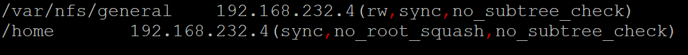

# shell脚本编程练习进阶（实验）
**FTP、NFS、DHCP、DNS、Samba服务器的自动安装与自动配置**

## 软件环境建议

### ProFTPD

[Configuring ProFTPD](http://www.proftpd.org/docs/howto/ConfigFile.html)

* [ ] 配置一个提供匿名访问的FTP服务器，匿名访问者可以访问1个目录且仅拥有该目录及其所有子目录的只读访问权限；

  - 修改`/etc/proftp/proftpd.conf`文件
  - 设置RequireValidShell off:无shell登录用户可以使用ftp

    

  - 结果

    

    

* [ ] 配置一个支持用户名和密码方式访问的账号，该账号继承匿名访问者所有权限，且拥有对另1个独立目录及其子目录完整读写（包括创建目录、修改文件、删除文件等）权限；
    * 该账号仅可用于FTP服务访问，不能用于系统shell登录；
* [ ] FTP用户不能越权访问指定目录之外的任意其他目录和文件；

    ```
    AuthOrder mod_auth_file.c mod_auth_unix.c
    AuthUserFile /usr/local/etc/proftpd/passwd
    AuthGroupFile /usr/local/etc/proftpd/group
    PersistentPasswd off
    RequireValidShell off

    # FTP用户不能越权访问指定目录之外的任意其他目录和文件
    DefaultRoot ~
    ```

    ```bash

    # 创建虚拟用户的本地ftp文件夹
    sudo mkdir /home/user1
    sudo mkdir /home/user2

    # 修改/home/virtual权限
    sudo chown -R 1024:1024 /home/user1
    sudo chmod -R 700 /home/user1
    sudo chown -R 1025:1024 /home/user2
    sudo chmod -R 700 /home/user2

    # 创建了一个user1和user2用户
    sudo ftpasswd --passwd --file=/usr/local/etc/proftpd/passwd --name=user1 --uid=1024 --home=/home/user1 --shell=/bin/false
    sudo ftpasswd --passwd --file=/usr/local/etc/proftpd/passwd --name=user1 --uid=1025 --home=/home/user1 --shell=/bin/false

    # 创建了一个virtualusers组
    sudo ftpasswd --file=/usr/local/etc/proftpd/group --group --name=virtualusers --gid=1024

    # 把user1和user2加入virtualusers组
    sudo ftpasswd --group --name=virtualusers --gid=1024 --member=user1 --member=user2 --file=/usr/local/etc/proftpd/group

    ```

    
* [ ] 匿名访问权限仅限白名单IP来源用户访问，禁止白名单IP以外的访问；


---
#### 遇到的问题:user1和user2同样的配置，user1可以登录，user2登录会报错


`/var/log/proftpd/proftpd.log` 错误消息如下：


user1和user2文件夹的权限如下


`/usr/local/etc/proftpd/passwd`如下：


`/usr/local/etc/proftpd/group`如下：


解决：命令行参数设置错误
chown [OWNER][:[GROUP]]
设置/home/user2的属性应为：`sudo chown -R 1025:1024 /home/user2`
---


### NFS
[How To Set Up an NFS Mount on Ubuntu 16.04](https://www.digitalocean.com/community/tutorials/how-to-set-up-an-nfs-mount-on-ubuntu-16-04)

* [ ] 在1台Linux上配置NFS服务，另1台电脑上配置NFS客户端挂载2个权限不同的共享目录，分别对应只读访问和读写访问权限；


  host: 192.168.232.3

  client: 192.168.232.4


  host `/etc/exports` 添加如下：

  

  client配置共享文件夹：

  

  host上,`/home`是只读访问,`/var/nsf/general`可读写访问

  

* [ ] 记录在NFS客户端上看到的：
    * 共享目录中文件、子目录的属主、权限信息

      client：

      

      host：

      

    * 通过NFS客户端在NFS共享目录中新建的目录、创建的文件的属主、权限信息

        client：

        

        host：

        

    * 上述共享目录中文件、子目录的属主、权限信息和在NFS服务器端上查看到的信息一样吗？无论是否一致，请给出你查到的资料是如何讲解NFS目录中的属主和属主组信息应该如何正确解读
      - 通过NFS客户端在NFS共享目录中新建的目录、创建的文件的属主、权限信息和在NFS服务器端上查看到的信息一样
      - 共享目录中文件、子目录的属主不一样，权限信息相同

      - 没有`no_root_squash`时，client新建文件的属主是nobody:nogroup。`/etc/exports`共享选项中添加`no_root_squash`，再新建文件后，文件属主变成root:root
        

        

      >`no_root_squash`: By default, NFS translates requests from a root user remotely into a non-privileged user on the server. This was intended as security feature to prevent a root account on the client from using the file system of the host as root. `no_root_squash` disables this behavior for certain shares.
      >
      >`no_root_squash` option allows our root users on the client machine to act as root and makes the administration of user accounts much more convenient. At the same time, it means we don’t have to give these users root access on the host.

### [Samba](https://wiki.samba.org/index.php/Setting_up_Samba_as_a_Standalone_Server)

```bash
# 安装Samba服务器
sudo apt-get install samba

# 创建Samba共享专用的用户
sudo useradd -M -s /sbin/nologin demoUser
sudo passwd demoUser

# 创建的用户必须有一个同名的Linux用户，密码是独立的
sudo smbpasswd -a demoUser
sudo smbpasswd -e demoUser
# 创建用户组
sudo groupadd demoGroup
# 添加用户组
sudo usermod -G demoGroup demoUser

# 创建文件夹
sudo mkdir -p /srv/samba/guest/
sudo mkdir -p /srv/samba/demo/

chgrp -R demoGroup /srv/samba/guest/
chgrp -R demoGroup /srv/samba/demo/

chmod 2775 /srv/samba/guest/
chmod 2770 /srv/samba/demo/

# 启动Samba
smbd

```

---

```ini
# 在/etc/samba/smb.conf 文件尾部追加以下“共享目录”配置
# guest为匿名用户可以访问的目录（不可写），demo为虚拟用户才能访问的目录（可读写）
[guest]
        path = /srv/samba/guest/
        read only = yes
        guest ok = yes
[demo]
        path = /srv/samba/demo/
        read only = no
        guest ok = no
        force create mode = 0660
        force directory mode = 2770
        force user = demoUser
        force group = demoGroup
# Forced Parameters 可以强制所有连接共享目录的用户创建的文件、目录使用特定的权限位设定、属主用户和属主组（有安全风险）
```

---

smbclient

```bash
sudo apt-get install smbclient
```

---

* Linux设置匿名访问共享目录

  guest 只读不可写

  

* Linux设置用户名密码方式的共享目录

  


* Linux访问Windows的用户名密码方式共享目录

  

---
  **遇到的问题：如下**

  

  **解决方法：命令行增加 `-m SMB2`**

---

* [下载整个目录](https://indradjy.wordpress.com/2010/04/14/getting-whole-folder-using-smbclient/)

  


### DHCP

1. 配置server端的`/etc/network/interface`文件，静态分配interl网卡的ip地址
    

2. `sudo apt install isc-dhcp-server`
3. 配置server的 `/etc/default/isc-dhcp-server`

    

4. 配置server的 `/etc/dhcp/dhcpd.conf`

    
5. server 开启 isc-dhcp-server 服务 `sudo systemctl start isc-dhcp-server`
6. client 开启 internal 网卡 `sudo ifconfig enp0s9 up`,使用dhclient `sudo dhclient enp0s9`,`ifconfig`后enp0s9网卡结果如下

    

### DNS
* 基于上述Internal网络模式连接的虚拟机实验环境，在DHCP服务器上配置DNS服务，使得另一台作为DNS客户端的主机可以通过该DNS服务器进行DNS查询

---

#### Server
  1. 安装bind9

    > sudo apt install bind9
    >
    > sudo apt install dnsutils

  2. 配置`/etc/bind/named.conf.local`,添加如下：

      

  3. 创建保存域名解析的db文件`sudo cp /etc/bind/db.local /etc/bind/db.cuc.edu.cn`
  4. 编辑`/etc/bind/db.cuc.edu.cn`文件

      

#### client
1. 添加解析服务器`sudo vi /etc/resolvconf/resolv.conf.d/head`
> search cuc.edu.cn
>
> nameserver 192.168.254.25

2. 更新resolv.conf文件`sudo resolvconf -u`

---

  

  


## shell脚本编程基本要求

---

* 目标测试与验证系统为本学期课程指定操作系统版本
* 自动安装与自动配置过程的启动脚本要求在本地执行
    * ***提示***：配置远程目标主机的SSH免密root登录，安装脚本、配置文件可以从工作主机（执行启动脚本所在的主机）上通过scp或rsync方式拷贝或同步到远程目标主机，然后再借助SSH的***远程命令执行***功能实现远程控制安装和配置
* 假设目标系统没有配置过root用户免密登录，所以我们要求在自动安装脚本中包含自动配置远程root用户免密登录的代码

---

* 脚本在执行过程中，如果需要在目标主机上创建目录、创建临时文件、执行网络下载等操作需要判断执行是否成功，并进行必要的异常处理（例如：apt-get update失败，则退出脚本执行，并将友好错误信息打印在控制台上。临时目录不存在，则自动创建该临时目录）
* 所有服务的配置文件、临时目录需设置正确的目录和文件归属和权限位，禁止使用***777***这种偷懒的权限位设置
* 减少不必要的安装过程中的人机交互输入，尽可能全部通过脚本的方式完成选项设置和交互式问题输入等

---

* 目标环境相关参数应使用独立的配置文件或配置脚本（在主调脚本中引用配置脚本）
    * 目标服务器IP
    * 目标服务器SSH服务的端口
    * 目标服务器上使用的用户名
    * 目标服务器上用于临时存储安装脚本、配置文件的临时目录路径


## [一键部署](scripts/)
### 目标主机配置
* 修改root密码：sudo passwd root  
* 编辑/etc/ssh/sshd_config文件：修改PermitRootLogin yes  
* mkdir /root/.ssh  
* touch /root/.ssh/authorized_keys  
* chmod 700 -R /root/.ssh  
* 重启ssh服务：service ssh restart  

### 本地主机配置
* 使用root用户：sudo su
* 创建公钥：ssh-keygen -t rsa
* 安装expect：apt-get install expect

## 参考资料
[Linux Sed命令详解](https://qianngchn.github.io/wiki/4.html)

[师哥师姐们的实验报告](https://github.com/CUCCS/linux/tree/master/2017-1)

[shell-script-automate-ssh-key-transfer-hosts-linux](http://www.techpaste.com/2013/04/shell-script-automate-ssh-key-transfer-hosts-linux/)
