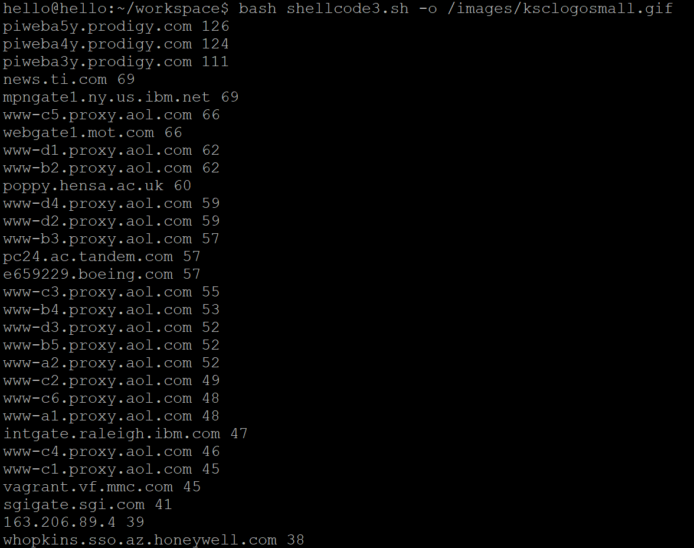

# shell脚本编程基础（实验）

## 任务一：用bash编写一个图片批处理脚本

[shell 脚本](shellcode1.sh)

### 对图片处理相关命令
```bash
# 输出文件类型
file --mime-type -b file_name

# 使用图像处理convert命令，首先要安装imagemagick
sudo  apt install imagemagick

# 对图片进行图片质量压缩
convert -quality value input_file output_file

# 对jpeg/png/svg格式图片在保持原始宽高比的前提下压缩分辨率
convert input_file -resize geometry output_file

# 添加文字水印
mogrify -gravity SouthEast -fill black -draw 'text 0,0 'text'' inputfile

# 重命名（统一添加文件名前缀或后缀，不影响原始文件扩展名）
mv file.jpg add_file.jpg

# 将png/svg图片统一转换为jpg格式图片
convert file.png file.jpg
```
### 实验结果
帮助文档


支持对jpeg格式图片进行图片质量压缩


支持对jpeg/png/svg格式图片在保持原始宽高比的前提下压缩分辨率


支持对图片批量添加自定义文本水印(添加水印到右下角，呈黄色)


支持批量重命名（统一添加文件名前缀或后缀，不影响原始文件扩展名）


支持将png/svg图片统一转换为jpg格式图片


## 任务二
### 用bash编写一个文本批处理脚本，对以下附件分别进行批量处理完成相应的数据统计任务

[shell 脚本](shellcode2.sh)

[2014世界杯运动员数据](exp/chap0x04/worldcupplayerinfo.tsv)


## 任务三
### 用bash编写一个文本批处理脚本，对以下附件分别进行批量处理完成相应的数据统计任务

[shell 脚本](shellcode3.sh)

[Web服务器访问日志](exp/chap0x04/web_log.tsv.7z)

帮助文档


统计访问来源主机TOP 100和分别对应出现的总次数


统计访问来源主机TOP 100 IP和分别对应出现的总次数


统计最频繁被访问的URL TOP 100


统计不同响应状态码的出现次数和对应百分比


分别统计不同4XX状态码对应的TOP 10 URL和对应出现的总次数


给定URL输出TOP 100访问来源主机


## 参考链接
[ImageMagicK 常用命令](http://www.hahack.com/wiki/tools-imagemagick.html)

[利用ImageMagicK给图片加水印](http://www.netingcn.com/imagemagick-mark.html)

[正则表达式](http://www.runoob.com/regexp/regexp-syntax.html)
